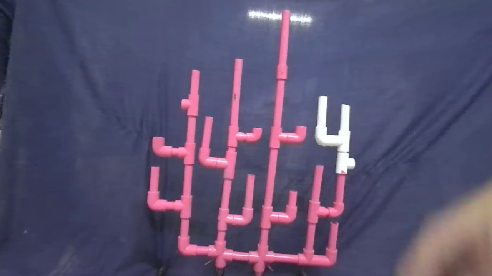
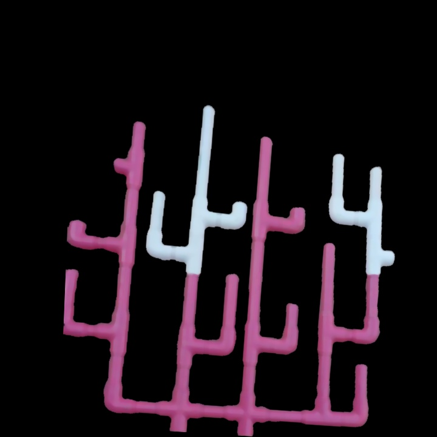
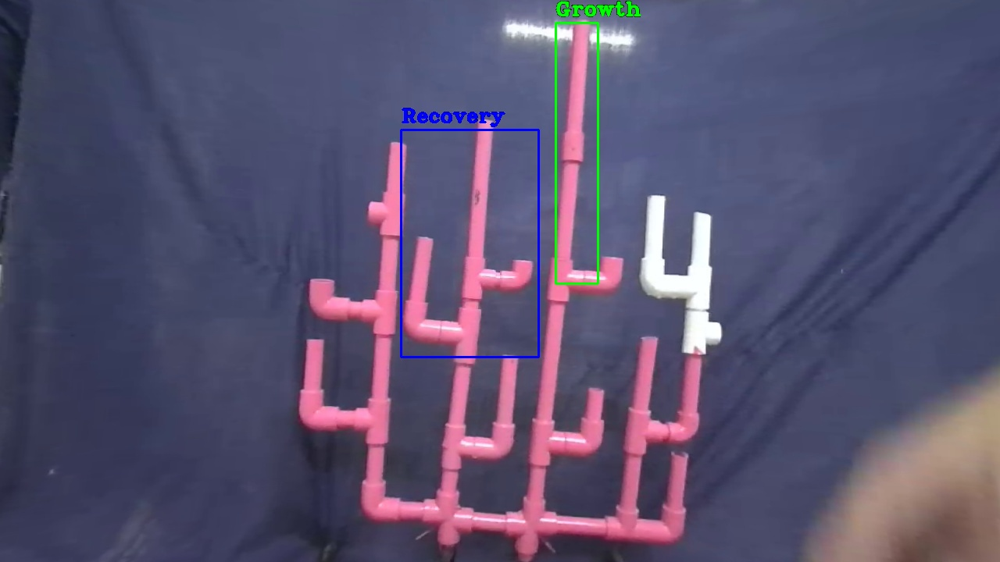

# Coral Reef Health Monitoring

This project uses image recognition techniques to monitor the health of coral reef colonies by comparing images from different time periods.

## Features

- Aligns images from different years using SIFT feature and homography.
- Applies noise reduction filters like median blur and Gaussian blur.
- Detects growth or death of coral colonies by subtracting images.
- Identifies bleaching or recovery by analyzing color differences in contours.
- Labels dissimilarities in colored boxes according to their case.

## Usage

1. Place last year's image and the current image in the project directory with names `last_year_image.jpg` and `current_image.jpg`.
2. Run the script:
    ```sh
    python coral_reef_health_monitoring.py
    ```
3. The result image will be saved as `result.jpg`.

## Example Images

- **The Current Image**:
  
- **The Last Year Image**:
  
- **The Aligned Image**:
  
- **The Final Image**:
  

## License

This project is licensed under the MIT License - see the [LICENSE](LICENSE) file for details.
